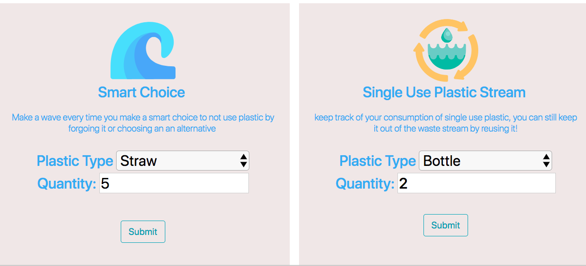

## NSS full stack final project 

## THIS IS THE LAST STRAW

## Full stack web app built on SNEP stack! AKA sequelize node express pug

# Track your consumption of single use plastic 

# Start here to initilizate the project

this interface assumes a global installation of psql 
if not already installed

`npm install psql -g`

steps :
to access all required dependencies 
`npm install`

# how to build database and connect to postgres
  **once your project is initiliazed as above**
1. Open in your terminal run `psql` 

2. `CREATE DATABASE plastictracker` create database named plastictracker

3. `\c plastictracker` connect to plastictracker

in the command line you will see "You are now connected to the database"

4. In your config.json file enter the name of the database you created in the previous step

`"database": "plastictracker",`

5. To build the database from the project

run `node build_db`

6. To compile your sass 
`npm run sass` will need to be running 

7. To run the app 

`nodemon app.js` **recommmended** 
** note `npm install -g nodemon` assumed but with no global install add nodemon to your dependencies `npm install --save-dev nodemon`

serving the app will present a login page.  A dummy user is in json in order for developers to login w/o re-registering each time

after login users are presented with a view to select type and quantity of plastic saved 
`http://localhost:8080/welcome`

after submission users are presented with totals of each type of plastic saved 

and 

users are presented with a view to select type and quantity of SUP consumed from the welcome page
submission directs users to view of sup with options to update sup status to either reused or recycled

## Authors

* **Courtney Brothers** - [courtneybrothers](https://github.com/courtneybrothers)

## License

This project is licensed under the MIT License - see the [LICENSE.md](LICENSE.md) file for details

## credits 

all icons and images used are attributed on the credits page of the application

**readme last updated 4/17/2018**

